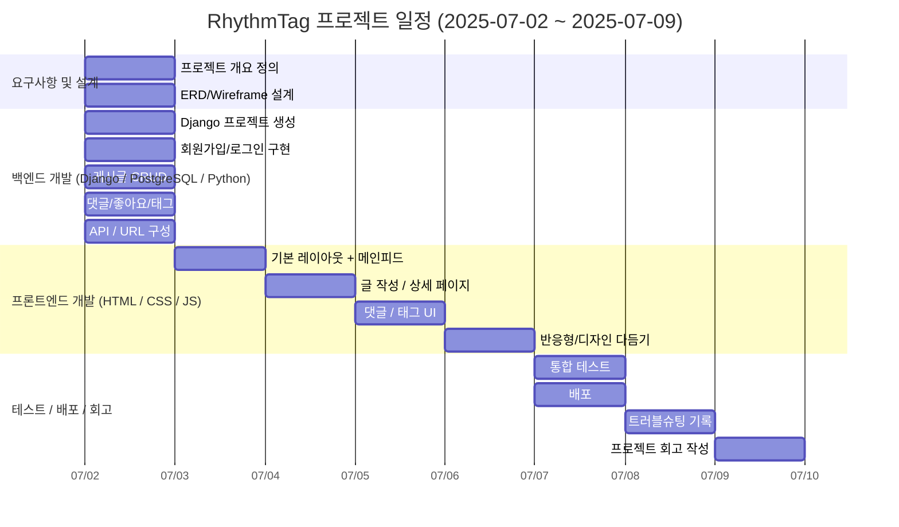

# RhythmTag🕺
태그를 포함하여 노래를 추천하고 공유하는 음악블로그

---

## 1️⃣ 프로젝트 개요
RhythmTag는 YouTube 링크를 기반으로 사용자가 노래를 추천하고,  
태그와 함께 공유하며, 다른 사용자의 추천곡을 탐색할 수 있는  
인스타그램형 음악 블로그 커뮤니티입니다.

주요 기능:
- YouTube 링크를 통한 노래 공유
- 태그 기반 곡 분류 및 탐색
- 댓글, 좋아요 기능
- 팔로잉, 팔로워 기능
---

## 2️⃣ 기술 스택
- **Frontend:** HTML, CSS, JavaScript (Vanilla / Bootstrap)
- **Backend:** Python, Django
- **Database:** PostgreSQL
- **Etc:** GitHub, Figma,

---

## 3️⃣ 프로젝트 실행 방법
**가상환경 실행**
source venv/bin/activate  # Mac/Linux
venv\Scripts\activate  # Windows

**패키지 설치**
pip install -r requirements.txt

**서버 실행**
python manage.py runserver

--- 

## 4️⃣ 기능 구성
* 회원가입 / 로그인 / 로그아웃
* 게시글 작성 / 수정 / 삭제 (YouTube 링크 포함)
* 태그 등록 / 검색
* 댓글 작성 / 삭제
* 좋아요
* 메인 피드 (최신 추천곡 리스트)
* 태그별 피드
* 팔로잉 / 팔로워 / 팔로잉삭제

---

# 5️⃣ ERD


---

# 6️⃣ URL 구성

---

# 7️⃣ WireFrame

---

# 8️⃣ 일정표 (WBS)


---

# 9️⃣ 시연 내용

---

# 🔟 트러블슈팅
## 1. Django 5.x와 summnernote 호환성 문제
**[ 문제 상황 ]**
Django 5.x 버전에서 django-summernote 사용 시 호환성 문제로 인한 오류 발생

**[ 원인 분석 ]**
1. 버전 호환성
- django-summernote는 Django 5.x의 변경사항을 완전히 지원하지 않음.
- Django 5.0에서 변경된 내부 API와 충돌 발생
- 특히 미디어 파일 처리, URL 패턴, 미들웨어 관련 호환성 이슈
2. 일반적인 오류
- JavaScript 로딩 불가능
- CSRF 토큰 관련 문제

**[ 해결 방법 ]**
✅ CKEditor로 마이그레이션
1. summernote 제거
``pip uninstall django-summernote``

2. CKEditor 설치
``pip install django-ckeditor``

3. settings.py 수정
```python
INSTALLED_APPS = [
    # ...
    # 'django_summernote',  # 제거
    'ckeditor',             # 추가
    'ckeditor_uploader',    # 이미지 업로드
    # ...
]
# CKEditor 설정
CKEDITOR_UPLOAD_PATH = "uploads/"
CKEDITOR_IMAGE_BACKEND = "pillow"
# Media 파일 설정
MEDIA_URL = '/media/'
MEDIA_ROOT = os.path.join(BASE_DIR, 'media')
```

4. urls.py 수정
```python
from django.urls import path, include
from django.conf import settings
from django.conf.urls.static import static

urlpatterns = [
    # ...
    # path('summernote/', include('django_summernote.urls')),  # 제거
    path('ckeditor/', include('ckeditor_uploader.urls')),     # 추가
    # ...
]

if settings.DEBUG:
    urlpatterns += static(settings.MEDIA_URL, document_root=settings.MEDIA_ROOT)
```

5. model.py 수정
```python
# 변경 전 (Summernote)
from django_summernote.fields import SummernoteTextField

class Post(models.Model):
    content = SummernoteTextField()

# 변경 후 (CKEditor)
from ckeditor_uploader.fields import RichTextUploadingField

class Post(models.Model):
    content = RichTextUploadingField(verbose_name='내용')
```

6. 마이그레이션 실행
```python
python manage.py makemigrations
python manage.py migrate
```

**[ 결론 ]**
- Django 5.x를 사용한다면 Summnernote 대신 CKEditor를 사용하는 것이 현명한 선택
- 호환성 문제 없이 안정적으로 리치텍스트 에디터 기능을 구현할 수 있음

## 2. 커스텀 User와 auth.User 
**[ 문제 상황 ]**
기존 auth.User를 커스텀 User로 변경 시도 중 다음과 같은 문제 발생 :
- 기존 테이블들이 auth.User를 외래키(ForeignKey)로 참조하고 있어 스키마 변경 충돌 발생
- 마이그레이션 충돌, 데이터 무결성 오류 발생
- 프로젝트가 정상 구동되지 않음

**[ 원인 분석 ]**
1️⃣ Django User 모델 변경의 특성
- Django의 User 모델은 프로젝트 생성 직후에 커스터마이징 해야함.
- 이미 auth.User를 참조하는 테이블이 생성된 이후 변경하면, DB 구조상 큰 충돌과 무결성 문제 발생

2️⃣ DB 외래키 제약
- auth.User를 참조하는 테이블(Post, Comment 등)의 ForeignKey가 기존 스키마와 충돌
- ForeignKey를 커스텀 User로 변경하는 과정에서 마이그레이션 실패

3️⃣ 데이터 무결성 문제
- 기존 데이터가 auth.User와 연결되어 있어 커스텀 User로 변경 불가

**[ 해결 방법 ]**
✅ DB 재생성 및 커스텀 User 적용
1️⃣ 기존 데이터베이스 삭제
``cd "C:\Program Files\PostgreSQL\17\bin"``
PostgreSQL bin 디렉토리로 이동
``.\psql.exe -U postgres -d postgres``
postgres 데이터 베이스 연결
```SELECT pg_terminate_backend(pid)
FROM pg_stat_activity
WHERE datname = 'blog_project' AND pid <> pg_backend_pid();
```
해당 데이터 베이스와의 모든 연결 강제 종료
``DROP DATABASE blog_project;``
기존 데이터베이스 삭제

2️⃣ 새로운 데이터베이스 생성
``CREATE DATABASE blog_project;``
```python
setting.py 수정
AUTH_USER_MODEL = 'accounts.User'
```
3️⃣ 마이그레이션 진행
``python manage.py makemigrations accounts``
``python manage.py makemigrations blog``
``python manage.py migrate``


# 1️⃣1️⃣ 프로젝트 진행하며 느낀 점
