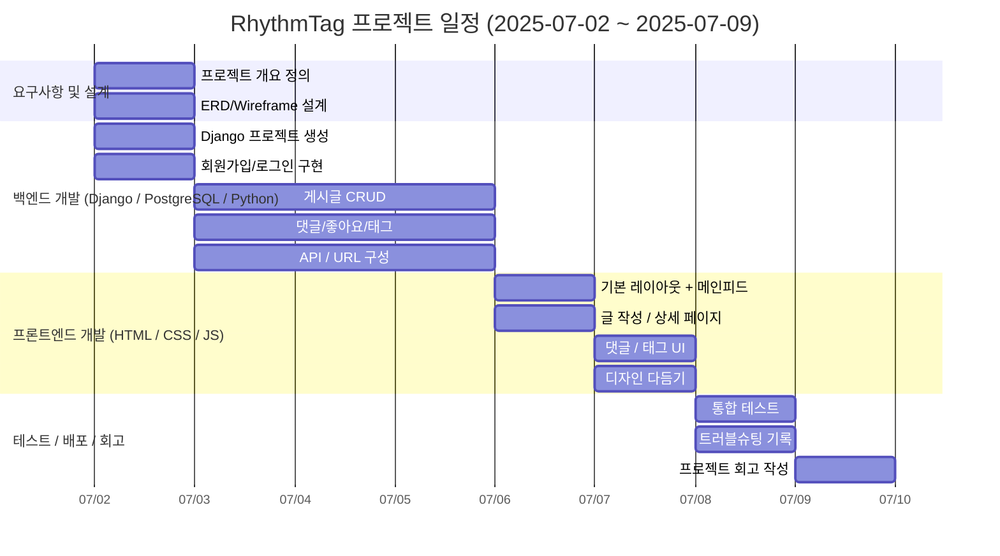

# RhythmTag🕺
태그를 포함하여 노래를 추천하고 공유하는 음악블로그

---

# 목차
- [프로젝트 개요](#1️⃣-프로젝트-개요)
- [기술 스택](#2️⃣-기술-스택)
- [프로젝트 실행 방법](#3️⃣-프로젝트-실행-방법)
- [기능 구성](#4️⃣-기능-구성)
- [데이터베이스 다이어그램(ERD)](#5️⃣-ERD)
- [폴더 트리](#6️⃣-폴더-트리)
- [URL 구성](#7️⃣-URL-구성)
- [WireFrame](#8️⃣-WireFrame)
- [WBS](#9️⃣-일정표-(WBS))
- [시연 내용](#🔟-시연-내용)
- [트러블슈팅](#1️⃣1️⃣-트러블슈팅)
- [느낀점](#1️⃣2️⃣-프로젝트-회고)

---

## 1️⃣ 프로젝트 개요
RhythmTag는 YouTube 링크를 기반으로 사용자가 노래를 추천하고,  
태그와 함께 공유하며, 다른 사용자의 추천곡을 탐색할 수 있는  
인스타그램형 음악 블로그 커뮤니티입니다.

주요 기능:
- YouTube 링크를 통한 노래 공유
- OpenAI API를 통한 글 생성
- 태그 기반 곡 분류 및 탐색
- 댓글, 좋아요 기능
- 팔로잉, 팔로워 기능
  
---

## 2️⃣ 기술 스택
- **Frontend:** HTML, CSS, JavaScript (Vanilla / Bootstrap)
- **Backend:** Python, Django
- **Database:** PostgreSQL
- **Etc:** GitHub, Figma

---

## 3️⃣ 프로젝트 실행 방법
**가상환경 실행**
```
source venv/bin/activate  # Mac/Linux
venv\Scripts\activate  # Windows
```

**패키지 설치**
``pip install -r requirements.txt``

**서버 실행**
``python manage.py runserver``

--- 

## 4️⃣ 기능 구성
* 회원가입 / 로그인 / 로그아웃
* 게시글 작성(AI 글 자동생성) / 수정 / 삭제 (YouTube 링크 포함)
* 태그 등록 / 검색
* 댓글 작성 / 수정 / 삭제
* 좋아요
* 메인 피드 (내가 작성한 글 / 팔로워 게시글 리스트 / 게시글 인기순 리스트)
* 태그별 피드
* 팔로잉 / 팔로워 / 팔로잉삭제

---

# 5️⃣ ERD


---

# 6️⃣ 폴더 트리
```
📦RHYTHMTAG
 ┣ 📦accounts
 ┃  ┣ 📦static
 ┃  ┃  ┣ 📦accounts
 ┃  ┃  ┃  ┣ 📦css
 ┃  ┃  ┃  ┃  ┣ 📜common.css
 ┃  ┃  ┃  ┃  ┣ 📜login.css
 ┃  ┃  ┃  ┃  ┣ 📜main.css
 ┃  ┃  ┃  ┃  ┣ 📜profile_delete.css
 ┃  ┃  ┃  ┃  ┣ 📜profile_password_update.css
 ┃  ┃  ┃  ┃  ┣ 📜profile_update.css
 ┃  ┃  ┃  ┃  ┣ 📜profile_user.css
 ┃  ┃  ┃  ┃  ┣ 📜profile.css
 ┃  ┃  ┃  ┃  ┗ 📜register.css
 ┃  ┃  ┃  ┗ 📦images
 ┃  ┃  ┃     ┣ 📜logo.png
 ┃  ┃  ┃     ┣ 📜menu.png
 ┃  ┃  ┃     ┗ 📜user.png
 ┃  ┣ 📦templates
 ┃  ┃  ┗ 📦accounts
 ┃  ┃     ┣ 📜login.html
 ┃  ┃     ┣ 📜main.html
 ┃  ┃     ┣ 📜profile_delete.html
 ┃  ┃     ┣ 📜profile_password_update.html
 ┃  ┃     ┣ 📜profile_update.html
 ┃  ┃     ┣ 📜profile_user.html
 ┃  ┃     ┣ 📜profile.html
 ┃  ┃     ┗ 📜register.html
 ┃  ┣ 📜admin.py
 ┃  ┣ 📜apps.py
 ┃  ┣ 📜forms.py
 ┃  ┣ 📜models.py
 ┃  ┣ 📜tests.py
 ┃  ┣ 📜urls.py
 ┃  ┣ 📜views.py
 ┃  ┗ 📜__init__.py
 ┣ 📦blog
 ┃  ┣ 📦static
 ┃  ┃  ┗ 📦blog
 ┃  ┃     ┣ 📦css
 ┃  ┃     ┃  ┣ 📜blog_update.css
 ┃  ┃     ┃  ┣ 📜common.css
 ┃  ┃     ┃  ┣ 📜post_delete.css
 ┃  ┃     ┃  ┣ 📜post_detail.css
 ┃  ┃     ┃  ┣ 📜post_form.css
 ┃  ┃     ┃  ┣ 📜post_list.css
 ┃  ┃     ┃  ┗ 📜post_update.css
 ┃  ┃     ┗ 📦images
 ┃  ┃        ┣ 📜logo.png
 ┃  ┃        ┣ 📜menu.png
 ┃  ┃        ┣ 📜post_delete_dance.jpg
 ┃  ┃        ┗ 📜user.png
 ┃  ┣ 📦templates
 ┃  ┃  ┗ 📦blog
 ┃  ┃     ┣ 📜base.html
 ┃  ┃     ┣ 📜blog_create.html
 ┃  ┃     ┣ 📜blog_delete.html
 ┃  ┃     ┣ 📜blog_update.html
 ┃  ┃     ┣ 📜post_delete.html
 ┃  ┃     ┣ 📜post_detail.html
 ┃  ┃     ┣ 📜post_form.html
 ┃  ┃     ┣ 📜post_list.html
 ┃  ┃     ┗ 📜post_update.html
 ┃  ┣ 📜admin.py
 ┃  ┣ 📜apps.py
 ┃  ┣ 📜forms.py
 ┃  ┣ 📜llm.py
 ┃  ┣ 📜models.py
 ┃  ┣ 📜music_post_create.py
 ┃  ┣ 📜tests.py
 ┃  ┣ 📜urls.py
 ┃  ┣ 📜views.py
 ┃  ┗ 📜__init__.py
 ┣ 📦RhythmTag
 ┃  ┣ 📜asgi.py
 ┃  ┣ 📜settings.py
 ┃  ┣ 📜urls.py
 ┃  ┣ 📜wsgi.py
 ┃  ┗ 📜__init__.py
 ┣ 📦venv
 ┃  ┣ 📦Include
 ┃  ┣ 📦Lib
 ┃  ┣ 📦Scripts
 ┃  ┗ 📜pyvenv.cfg
 ┣ 📜.env
 ┣ 📜.gitignore
 ┣ 📜db.sqlite3
 ┣ 📜manage.py
 ┣ 📜README.md
 ┗ 📜requirements.txt
```

---

# 7️⃣ URL 구성

### Config (메인 프로젝트)
| URL Pattern | View | Description |
|-------------|------|-------------|
| `admin/` | admin.site.urls | Django 관리자 인터페이스 |
| `ckeditor/` | ckeditor_uploader.urls | CKEditor URL 패턴 |
| `""` | accounts.urls | 계정 앱의 URL 패턴 |
| `blog/` | blog.urls | 블로그 앱의 URL 패턴 |

### Accounts App

| URL Pattern | View | Description |
|-------------|------|-------------|
| `""` | MainPageView | 메인 페이지 |
| `login/` | CustomLoginView | 사용자 로그인 |
| `register/` | CustomRegisterView | 사용자 등록 |
| `logout/` | CustomLogoutView | 사용자 로그아웃 |
| `profile/` | MyProfileView | 본인 프로필 페이지 |
| `profile/update/` | ProfileUpdateView | 프로필 정보 수정 |
| `profile/passwordupdate/` | PasswordChangeView | 비밀번호 변경 |
| `profile/delete/` | AccountDeleteView | 계정 삭제 |
| `user/<int:user_id>/profile/` | UserProfileView | 다른 사용자 프로필 페이지 |
| `user/<int:user_id>/follow/` | toggle_follow | 사용자 팔로우 토글 |
| `follow/<str:userid>/` | follow_user | 사용자 팔로우 |
| `unfollow/<str:userid>/` | unfollow_user | 사용자 언팔로우 |
| `users/` | UserListView | 사용자 목록 |

### Blog App

| URL Pattern | View | Description |
|-------------|------|-------------|
| `""` | PostListView | 게시글 목록 |
| `post/write/` | PostWriteView | 게시글 작성 |
| `post/<int:pk>/` | PostDetailView | 게시글 상세 보기 |
| `post/<int:pk>/update/` | PostUpdateView | 게시글 수정 |
| `post/<int:pk>/delete/` | PostDeleteView | 게시글 삭제 |
| `post/<int:post_id>/like/` | toggle_like | 게시글 좋아요 토글 |
| `generate-ai-blog/` | generate_ai_blog | AI 블로그 생성 |
| `create/` | BlogCreateView | 블로그 생성 |
| `update/` | BlogUpdateView | 블로그 정보 수정 |
| `delete/` | BlogDeleteView | 블로그 삭제 |
| `post/<int:pk>/comment/` | add_comment | 댓글 작성 |
| `comment/<int:pk>/edit/` | edit_comment | 댓글 수정 |
| `comment/<int:pk>/delete/` | delete_comment | 댓글 삭제 |

---

# 8️⃣ WireFrame
- figma
  https://www.figma.com/design/a1hqX73BR2dwpqVSm7OUy6/RhythemTag?node-id=2-2&t=WySSLEr3kErLPiYc-1

---

# 9️⃣ 일정표 (WBS)


---

# 🔟 시연 내용
### 구현 상세
1. 메인화면
    - 페이지 제목, 블로그 입장하기 버튼이 있습니다.
    - 회원가입/로그인 버튼이 있습니다.
    - 회원가입 버튼을 누르면 회원가입 페이지로 이동합니다.
    - 로그인 버튼을 클릭하면 로그인 페이지로 이동합니다.


2. 회원가입 기능 구현
    - 아이디, 비밀번호, 비밀번호 확인, 이름, 전화번호, 닉네임을 입력받습니다.
    - 비밀번호 제약
      ✅ 8자 이상이어야 합니다
      ✅ 숫자만으로는 구성할 수 없습니다
      ✅ 아이디나 닉네임이 포함될 수 없습니다
      ✅ 연속된 문자나 숫자는 사용할 수 없습니다

3. 로그인 기능 구현
    - 아이디, 비밀번호를 입력받습니다.
    - 입력한 아이디가 틀렸을 때 : 존재하지 않는 아이디입니다.
    - 입력한 아이디와 비밀번호가 일치하지 않을 때 : 비밀번호가 틀렸습니다.
  
4. 게시글 작성 기능 구현
    - 로그인을 하지 않아도 게시글을 볼 수 있습니다.
    - 로그인을 하지 않은 유저가 글 작성을 시도할 경우, "로그인이 필요합니다"라는 메세지와 함께 로그인 창으로 이동합니다.
    - 게시글의 조회수가 증가합니다. (중복 증가x)
    - AI 자동 글 생성 기능을 통해 내용을 입력받고, 입력 받은 내용을 기반으로 글을 작성합니다.

5. 게시글 목록 기능 구현
    - 모든 사용자들이 게시한 블로그 게시글 들의 제목을 확인할 수 있습니다.
    - 좋아요 갯수가 표시됩니다.
    - 목록 하단의 태그를 클릭하면, 해당 태그가 사용된 게시글을 모두 확인할 수 있습니다.
    - 내가 작성한 글, 팔로잉/팔로워의 글, 좋아요 순으로 정렬된 인기가 많은 글 탭을 통해 특정 조건의 게시글을 확인할 수 있습니다.
    - 블로그를 생성하지 않았다면, 블로그를 생성할 수 있는 버튼이 노출됩니다.
    - 블로그를 생성하지 않아도 모든 게시글을 확인할 수 있습니다.

6. 게시글 상세보기 기능 구현
    - 게시글의 제목/내용/글 작성자/유튜브 영상을 확인할 수 있습니다.
    - 작성자를 클릭하면 작성자의 프로필을 확인할 수 있습니다. 프로필에서는 해당 유저가 작성한 모든 글을 확인할 수 있습니다.
    - 좋아요를 누를 수 있습니다.
    - 내가 작성한 글만 수정/삭제 할 수 있습니다. 작성자가 아닌 사용자에게는 수정/삭제 버튼이 숨김처리 됩니다.

7. 게시글 검색 기능 구현
    - 제목, 내용의 키워드를 검색 가능합니다.
    - 좋아요 순서, 시간순에 따라 정렬됩니다.

8. 게시글 수정 기능 구현
    - 본인이 작성한 글만 해당 기능을 사용할 수 있습니다.
    - 게시글의 제목/내용/링크/태그를 수정할 수 있습니다.
    - 수정된 내용이 게시글 목록보기/상세보기에 반영됩니다.

9. 게시글 삭제 기능 구현
   - 본인이 작성한 글만 해당 기능을 사용할 수 있습니다.
   - 게시글의 모든 정보를 삭제합니다.
   - 삭제를 완료한 후 게시글 목록 화면으로 이동합니다.

10. 회원 관련 기능
    - 내 블로그 정보를 확인할 수 있습니다.
    - 내 블로그 정보 수정/삭제 기능이 있습니다.
    - 최근에 작성한 게시글을 리스트로 확인할 수 있으며, 클릭시 해당 게시글 상세페이지로 이동합니다.
    - 내 프로필 정보를 확인합니다.
    - 프로필 수정을 통해 비밀번호, 이름, 전화번호, 닉네임을 변경할 수 있습니다. 아이디는 변경할 수 없습니다.
    - 회원 탈퇴를 통해 회원 정보를 영구적으로 삭제합니다. 해당 기능 사용시 블로그, 게시글, 댓글, 좋아요, 팔로잉/팔로워 등이 전부 삭제됩니다.
    - 팔로잉/팔로워 목록을 확인할 수 있습니다.
    - 나를 팔로우한 사람의 프로필을 확인할 수 있으며, 팔로우 백을 통해 나를 팔로우 한 유저를 팔로우 하거나 언팔로우를 통해 내가 팔로우 한 사람을 삭제할 수 있습니다.

11. 댓글 기능
    - 게시글 상세페이지 하단에서 댓글을 달 수 있습니다.
    - 본인이 작성한 댓글만 수정/삭제할 수 있습니다.


---

# 1️⃣1️⃣ 트러블슈팅

## 1. Django 5.x와 summnernote 호환성 문제

**[ 문제 상황 ]**

Django 5.x 버전에서 django-summernote 사용 시 호환성 문제로 인한 오류 발생

**[ 원인 분석 ]**

1. 버전 호환성
- django-summernote는 Django 5.x의 변경사항을 완전히 지원하지 않음.
- Django 5.0에서 변경된 내부 API와 충돌 발생
- 특히 미디어 파일 처리, URL 패턴, 미들웨어 관련 호환성 이슈

2. 일반적인 오류
- JavaScript 로딩 불가능
- CSRF 토큰 관련 문제

**[ 해결 방법 ]**

✅ CKEditor로 마이그레이션
1. summernote 제거
``pip uninstall django-summernote``

2. CKEditor 설치
``pip install django-ckeditor``

3. settings.py 수정
```python
INSTALLED_APPS = [
    # ...
    # 'django_summernote',  # 제거
    'ckeditor',             # 추가
    'ckeditor_uploader',    # 이미지 업로드
    # ...
]
# CKEditor 설정
CKEDITOR_UPLOAD_PATH = "uploads/"
CKEDITOR_IMAGE_BACKEND = "pillow"
# Media 파일 설정
MEDIA_URL = '/media/'
MEDIA_ROOT = os.path.join(BASE_DIR, 'media')
```

4. urls.py 수정
```python
from django.urls import path, include
from django.conf import settings
from django.conf.urls.static import static

urlpatterns = [
    # ...
    # path('summernote/', include('django_summernote.urls')),  # 제거
    path('ckeditor/', include('ckeditor_uploader.urls')),     # 추가
    # ...
]

if settings.DEBUG:
    urlpatterns += static(settings.MEDIA_URL, document_root=settings.MEDIA_ROOT)
```

5. model.py 수정
```python
# 변경 전 (Summernote)
from django_summernote.fields import SummernoteTextField

class Post(models.Model):
    content = SummernoteTextField()

# 변경 후 (CKEditor)
from ckeditor_uploader.fields import RichTextUploadingField

class Post(models.Model):
    content = RichTextUploadingField(verbose_name='내용')
```

6. 마이그레이션 실행
```python
python manage.py makemigrations
python manage.py migrate
```

**[ 결론 ]**

- Django 5.x를 사용한다면 Summnernote 대신 CKEditor를 사용하는 것이 현명한 선택

- 호환성 문제 없이 안정적으로 리치텍스트 에디터 기능을 구현할 수 있음

---

## 2. 커스텀 User와 auth.User 

**[ 문제 상황 ]**

기존 auth.User를 커스텀 User로 변경 시도 중 다음과 같은 문제 발생 :
- 기존 테이블들이 auth.User를 외래키(ForeignKey)로 참조하고 있어 스키마 변경 충돌 발생
- 마이그레이션 충돌, 데이터 무결성 오류 발생
- 프로젝트가 정상 구동되지 않음

**[ 원인 분석 ]**

1️⃣ Django User 모델 변경의 특성
- Django의 User 모델은 프로젝트 생성 직후에 커스터마이징 해야함.
- 이미 auth.User를 참조하는 테이블이 생성된 이후 변경하면, DB 구조상 큰 충돌과 무결성 문제 발생

2️⃣ DB 외래키 제약
- auth.User를 참조하는 테이블(Post, Comment 등)의 ForeignKey가 기존 스키마와 충돌
- ForeignKey를 커스텀 User로 변경하는 과정에서 마이그레이션 실패

3️⃣ 데이터 무결성 문제
- 기존 데이터가 auth.User와 연결되어 있어 커스텀 User로 변경 불가

**[ 해결 방법 ]**

✅ DB 재생성 및 커스텀 User 적용

1️⃣ 기존 데이터베이스 삭제

``cd "C:\Program Files\PostgreSQL\17\bin"``

PostgreSQL bin 디렉토리로 이동

``.\psql.exe -U postgres -d postgres``

postgres 데이터 베이스 연결
```
SELECT pg_terminate_backend(pid)
FROM pg_stat_activity
WHERE datname = 'blog_project' AND pid <> pg_backend_pid();
```

해당 데이터 베이스와의 모든 연결 강제 종료

``DROP DATABASE blog_project;``

기존 데이터베이스 삭제

2️⃣ 새로운 데이터베이스 생성

``CREATE DATABASE blog_project;``

```python
setting.py 수정
AUTH_USER_MODEL = 'accounts.User'
```

3️⃣ 마이그레이션 진행

``python manage.py makemigrations accounts``

``python manage.py makemigrations blog``

``python manage.py migrate``


# 1️⃣2️⃣ 프로젝트 회고

### 성취와 만족

이번 프로젝트는 1차 미니 프로젝트보다 시간도 많이 주어졌고, 이번 프로젝트를 시작하기 전의 기간 동안 새롭게 배운 기술들이 많아 응용하는 즐거움이 있었습니다. 1차 미니 프로젝트에서는 시간 부족 및 여러 오류들로 OpenAI API를 적용하지 못했는데, 이번에는 큰 오류 없이 잘 적용되어 만족스러운 프로젝트가 되었습니다.

기능을 하나씩 구현해낼 때마다 성취감이 들었고, 특히 Django의 기본 'auth_user' 대신 커스텀 'User' 모델을 구현하는 도전을 통해 개발의 무한한 매력을 느끼게 되었습니다. 이번 프로젝트에서 기능 구현에 성공했을 때의 기분을 오래 기억하고, 이 기분을 다시 느끼기 위해 끊임없이 노력하는 개발자가 될 것입니다.

### Django의 편리함 재확인

Django의 여러 라이브러리를 경험하며 역시 Django를 통한 개발 환경은 편하다는 것을 다시금 느끼게 되었습니다. 다양한 내장 기능과 서드파티 라이브러리들이 개발 효율성을 크게 높여주었습니다.

### 아쉬웠던 점들
1. **계획 수립의 아쉬움**

    조금 더 체계적으로 계획을 짜지 못해서 중간중간 놓친 기능들을 채우느라 시간을 허비한 점이 아쉬웠습니다. 더 철저한 기획 단계가 필요하다는 것을 깨달았습니다.
   
2. **프론트엔드 집중으로 인한 백엔드 기능 누락**

   백엔드보다는 프론트엔드에 조금 더 신경을 쓰다 보니 백엔드 기능 중 대댓글 기능을 구현하지 못한 것이 너무 아쉬웠습니다. 기능의 우선순위를 더 명확히 설정했어야 한다는 반성이 듭니다.
   
### 향후 계획

추후에 대댓글 기능까지 추가하여 프로젝트를 더욱 완성도 높게 발전시키고 싶습니다. 이번 경험을 바탕으로 다음 프로젝트에서는 더 체계적인 계획 수립과 기능별 우선순위를 명확히 하여 진행할 예정입니다.


